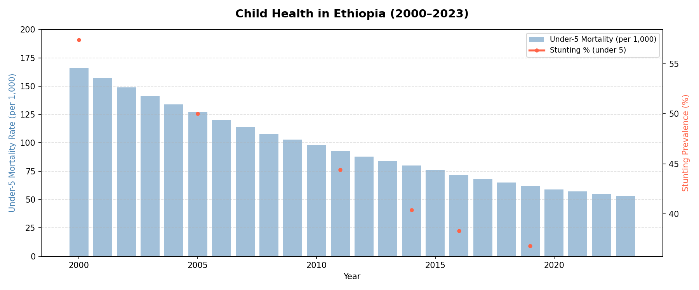
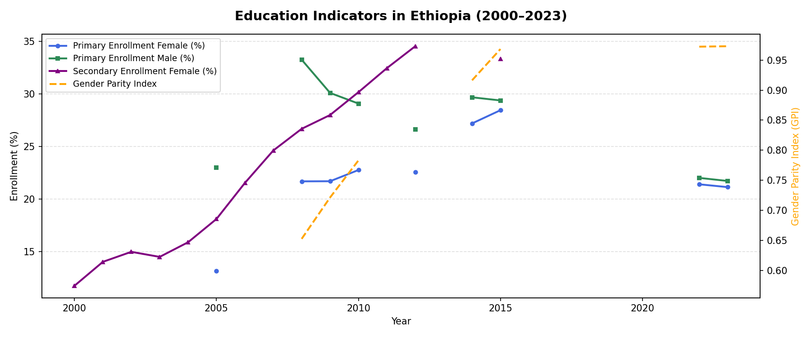
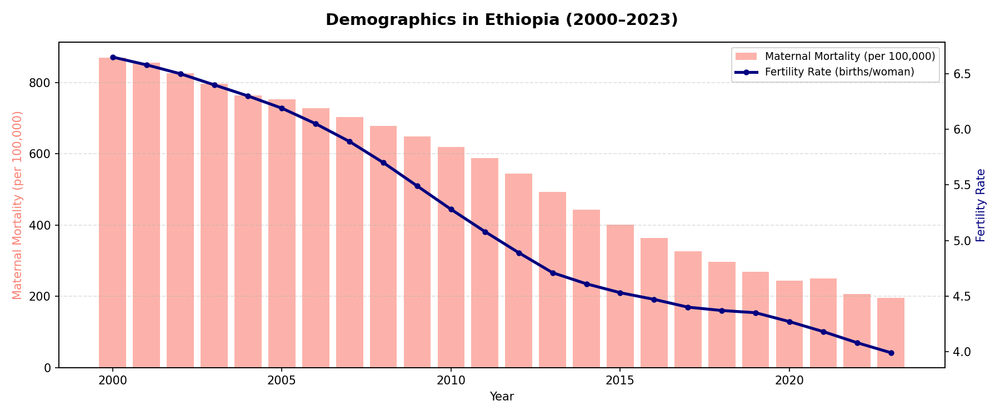

# 🇪🇹 Ethiopia Human Capital Analysis (2000–2023)

**Tools:** Python · Pandas · Matplotlib · Google Colab
**Data Source:** World Bank World Development Indicators

## Overview

This project visualizes over two decades of human capital development in Ethiopia
through three data charts covering child health, education, and demographics.
The analysis is grounded in human capital theory — the idea that investments in
health and education are central drivers of economic growth and productivity.

Ethiopia has made remarkable strides since 2000: under-5 mortality fell from 166
to around 48 per 1,000 live births, and primary school enrollment surpassed 85%.
Yet the data also reveals persistent challenges — 37% of children remain stunted,
girls' secondary enrollment lags significantly, and maternal mortality remains high
at approximately 401 deaths per 100,000 live births.

## Charts

| Chart | Indicators |
|---|---|
| Child Health | Under-5 Mortality · Stunting Prevalence |
| Education | Primary Enrollment (M & F) · Secondary Enrollment (F) · Gender Parity Index |
| Demographics | Maternal Mortality · Fertility Rate |

## How to Run

1. Open the `.ipynb` file in [Google Colab](https://colab.research.google.com/)
2. Upload `Ethiopia_Human_Capital_Master.csv` when prompted
3. Run all cells to generate the three charts
## Visualizations

